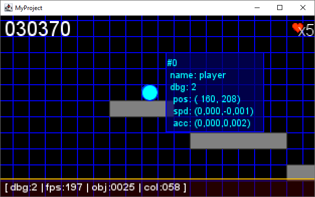
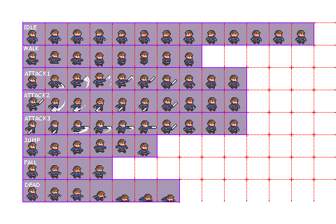
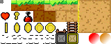

# MyProject

This is a Basic java program to rediscover how to code in java from scratch, without framework and runtime libraries.

Only Junit will be used for test purpose.

## Build

A simple maven command will help :

```bash
mvn clean install
```

## Execute the program

After building, you may execute the code from the `target/`:

```bash
java -jar target/demoapp-1.0.0.jar
```

You will see appearing such a window:



> _**NOTE**_<br/> > _You can also use the maven command line:_
>
> ```shell
> mvn exec:java
> ```

## Usage

Basic commands:

| Key              | Description                 |
| :--------------- | :-------------------------- |
| <kbd>UP</kbd>    | move up player              |
| <kbd>DOWN</kbd>  | move down player            |
| <kbd>LEFT</kbd>  | move left player            |
| <kbd>RIGHT</kbd> | move right player           |
| <kbd>CTRL</kbd>  | player speed x 2            |
| <kbd>SHIFT</kbd> | player speed x 6            |
| <kbd>Z</kbd>     | regenerate platforms        |
| <kbd>Esc</kbd>   | quit demo                   |
| <kbd>D</kbd>     | switch debug mode ( 0 to 5) |

> __Note__ 
> Mouse click on an object to siwtch its own debug level from 0 to 5.

## Futur is coming

Here is bellow some possible enhancement of this project to bring more possibilities in game design ! 

- Animated [`GameObject`](./src/main/java/com/demoapp/core/entity/GameObject.java) with an `Animation` object will cover the famous sprite purpose,  



- The current backgound color is set to `#000000`, but soon a new background image feature will be added with the tile map management integration, to gicving easy access to real platform level design with smart and fun graphism, and some new `Behavior` implmebtation tp give more coding flexibitlity and resusabilty to [`GameObject`](./src/main/java/com/demoapp/core/entity/GameObject.java) ans [`Scene`](./src/main/java/com/demoapp/core/servcies/scene/Scene.java)



- Sounds will eventually poped-up in a futur release, with the help of goos old Google libraries like `jlayer`, `mp3spi` and `tritonus-share` , bringing MP3 and OGG sound support to the java sound API (see the [Tritonus project](http://www.tritonus.org/) and [Java Sound API](https://www.oracle.com/java/technologies/tiger.html).

McG.
