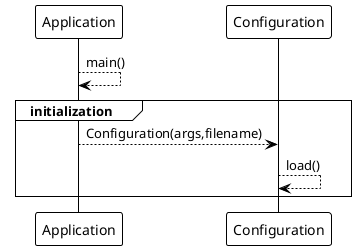

# My Project

## Introduction

This `Application` program is a code sample to explain how to design, test and document a project, through a simple
program.

It intends to create a small game with multiple components, and draw a way of work on when to decide to break
architecture and introduce new concepts or patterns.

The global overview is an Old-school 2D "pixelated" game, with at start a basic game loop concept.

And along the development, we wil split concerns dans delegate some processing to dedicated components.
Som split can be decided at start, regarding the evident contextual domain, or during development, introducing breaking
changes in the architecture.

## Some basic choices

To illustrate purposes, we will analyse some code parts and draw some diagrams with PlantUML.

Code will appear without its javadoc or comment to simplify visibility and readability:

And we won't rely on some complex external library, but only use what the JDK proposes.

>**NOTE**: An exception is done for Unit test capability by introducing JUnit5.

As a choice, we will use only the `System.out` as a log capability.

```java
public class Application {
    private String title = "defaultTitle";

    public static void man(String[] args) {
        System.out.printf("This is an output log for %s%n", title);
    }
}
```

And using the [PlantUML](https://plantuml.org "go and discover this fanstatic tool") to draw sequence diagram or class diagram:



## Content

1. [The Application](01-the_application.md)
2. [Configuration component](02-configuration_component.md)
3. [Adding a Window for display](03-display_window.md)
4. [Brining the GameLoop](04-delegate_gameloop.md)
5. [Moving input management into component](05-input_handler.md)
6. [Managing Game objects](06-manage_game_object.md)
7. [Rendering things](07-create_renderer.md)
8. [Scene Management](08-scene_management.md)
9. [Adding Camera to Scene](09-add_camera_to_scene. md) 
