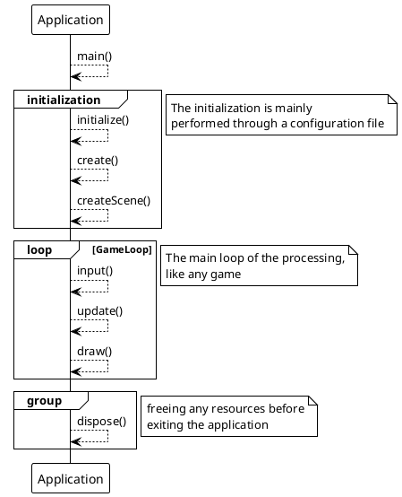

# The Application

The `Application` class is the main application class, containing the main entry point to start the program.

This class is the core of our program, driving the game loop, and managing all the component's lifecycle.

THe following diagram present the global processing for the Application.



Now we got a global overview, we can go in details.

## The Application class

We rely on the basic java entry point.

```java
public class Application {

    private Application(String[] args) {
        // to be defined later
    }

    private run() {
        // to be defined later
    }

    public static void main(String[] args) {
        Application app = new Application(args);
        app.run();
    }
}
```

And start implementing things.

### Running

THe configuration loading will be delegated to the Configuration component (see
chapter [02](02-configuration_component.md)).

The all processing of the `Application` is happening in the `run()` method.

```java
public class Application {
    //...
    public void run() {
        System.out.printf("INFO : Application | %s started%n", config.getTitle());
        create();
        if (!isTestMode()) {
            loop();
            dispose();
        }
    }
    //...
}
```

First `create` the game play components and then start the main game `loop()`. After, when exit will be request,
`dispose()` all preempted resources.

Focusing on important thing: `create();`, used to create all the needed components for Application
and initializing the Application itself.

### Create application

All the services and components the application will need must be created from this point:

```java
public class Application {
    //...
    private void create() {
        window = new Window(
                config.getTitle(),
                config.getWindowDimension())
                .attachHandler(new InputHandler());
        render = new Renderer(config);
        gameLoop = new StandardGameLoop();
        scm = new SceneManager(this);

        createScene();
    }
    //...
}
```

Here, a `Window`, a `Renderer`, a `GameLoop` and a `SceneManager` will be initialized.

| Component    | Description                                             |         Ref. chapter          |
|:-------------|:--------------------------------------------------------|:-----------------------------:|
| Window       | A component to bridge OS window with our display needs. |  [03](03-display_window.md)   |
| Renderer     | The rendering processing for our drawing pipeline       |  [07](07-create_renderer.md)  | 
| GameLoop     | the heart of the loop where everything is orchestrated  | [04](04-delegate_gameloop.md) |
| SceneManager | A gamePLay switcher through multiple Scene.             | [08](08-scene_management.md)  |

