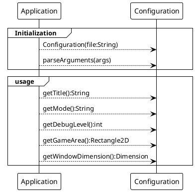

# Configuration component

The configuration in any project, is sometime a mess. Here is a way to maintain and delegate such subject to a dedicated
component, but accessible to every other as source of truth for configuration attributes values and default values.

## Some requirement

First, some requirements are identified, mandatory ones and optional ones.

### Mandatory

|  # UC  | Description                                                                                                             |
|:------:|:------------------------------------------------------------------------------------------------------------------------|
| UC0201 | Configuration values are stored in a properties file                                                                    |
| UC0202 | Configuration attributes are attributes of the `Configuration` component                                                |
| UC0203 | In case no file is provided (not existing or not accessible), the configuration will go with hard coded default values. |
| UC0204 | Configuration loaded values can be overloaded by command line arguments values, at start time.                          |
| UC0205 | Configuration must support String, Integer and Double as values.                                                        |

### Optional

|  # UC  | Description                                                          |
|:------:|:---------------------------------------------------------------------|
| UC0206 | If configuration file change, the values are automatically reloaded. |

## Design

The following Class diagram bring the implementation overview.

```plantuml
@startuml "Configuration design"
!theme plain
hide methods
hide attributes
class Application
show Configuration attributes
show Configuration methods
class Configuration{
  +title:String
  +debugLevel:int
  +mode:int
  +windowDimension:Dimension
  +gameArea:Rectangle2D
  ----
  -initDefaultValues():void
  -loadProperties(file:String):void
  -populateValues():void
  -getInteger(key:String,defaultValue:String):Integer
  -getDouble(key:String,defaultValue:String):Double
  -parseArgument(key:String,value:String):void
  +parseArguments(arg:String[]):void
  ----
  //some getters and setters
}
Application --> Configuration:config
@enduml
```


### Configuration from Application

The Configuration component is loaded at Application initialization:



So at initialization in the Application class :

```java
public class Application {
    //...
    public Application(String[] args, String configurationFilename) {
        config = new Configuration(configurationFilename);
        config.parseArguments(args);
    }
    //...
}
```

### Configuration consumption

And in some processing from the `Renderer` class, creating from some configuration parameters:

```java
public class Renderer {
    //...
    public Renderer(Configuration config) {
        this.buffer = new BufferedImage(
                (int) config.getGameArea().getWidth(),
                (int) config.getGameArea().getHeight(), BufferedImage.TYPE_INT_ARGB);
    }
    //...
}
```
