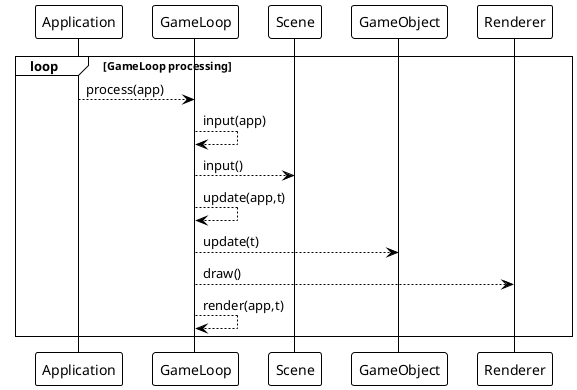
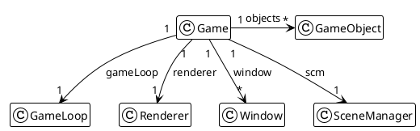

# GameLoop component

All the step of a game loop can be defined following multiple strategy :

- FPS first, when FPS if VERY important and quality rendering is not
- Processing first, when FPS respect is not mandatory, and rendering quality must be maintained.

So the game loop implementation must be delegated to a dedicated component. This where we propose a GameLoop interface.

## Requirements

|  UC    | Description                                        |
|:------:|:---------------------------------------------------|
| UC0401 | Game loop must support input management delegation |
| UC0402 | Game loop delegates update of entities             |
| UC0403 | Game loop triggers scene drawing                   |
| UC0405 | Game loop must provide a execution duration metric |

So all those specific processing topic must be processed from only one call.
It needs to propose an interface to define a such game loop:

```java
public interface GameLoop {
    long process(Application app);

    void input(Application app);

    void update(Application app, long elapsed);

    void render(Application app, long elapsed);
}
```

- `process` will return a number of nanosecond as a duration of execution.

## Standard implementation

To understand where is the GameLoop in our design, let's introduce it through a Sequence diagram:


And a class diagram :



Let's dive into our first simple implementation, without FPS or time constrain.

```java
public class StandardGameLoop implements GameLoop {

    long previousTime = System.nanoTime();

    public long process(Application app) {
        long startTime = System.nanoTime();
        input(app);
        long elapsed = startTime - previousTime;
        update(app, elapsed);
        render(app, elapsed);
        previousTime = startTime;
        return System.nanoTime() - startTime;
    }

    public void input(Application app) {
        // todo Implement the required processing for managing input
    }

    public void update(Application app, long elapsed) {
        // todo Implement the required processing for updating
    }

    public void render(Application app, long elapsed) {
        // todo Implement the required processing for rendering
    }
}
```

These are the 3 main steps of a game loop cycle.

- manage input,
- update entities,
- draw things.

### Manage inputs

Listening to all input event is delegated to the `InputHandler` component, see the chapter [05](05-input_handler.md) for
details.

```java
public class StandardGameLoop implements GameLoop {
    //...
    public void input(Application app) {
        // todo Implement the required processing for managing input
    }
    //...
}
```

### Updating objects

Diving into this part, we will delegate objects update to themselves, this part will be implemented in
chapter [06](06-manage_game_object.md).

```java
public class StandardGameLoop implements GameLoop {
    //...
    public void update(Application app, long elapsed) {
        
        /* parse all objects from application and update themselves.
        
        app.getObjects.values().forEach(go -> {
            go.update(elapsed);
        });
        
        */
    }
    //...
}
```

### Rendering

The rendering will be delegated to the Renderer component (see chapter [07](07-create_renderer.md)).

```java
public class StandardGameLoop implements GameLoop {
    //...
    public void render(Application app, long elapsed) {
        app.getRender().draw(app);
        app.getRender().drawToWindow(app.getWindow());
    }
    //...
}
```
