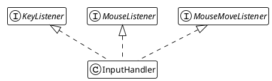
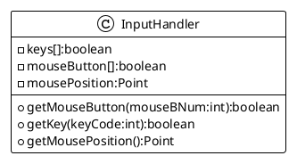
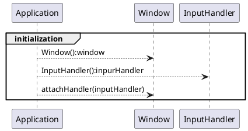

# Delegating Input handling

The `InputHandler` class is nothing else than a AWT Listener implementation with some state cache for keyboard and
mouse.

The purpose of that new component is to build and maintain key state cache, mouse button cache and latest known mouse
position.



And then, add some internal input caches and getters:



Some detailed implementation around cache sizing at construction:

```java
public class InputHandler implements KeyListener, MouseListener, MouseMoveListener {
    private boolean[] keys;
    private boolean[] mouseButton;
    private Point mousePosition;

    public InputHandler() {
        keys = new boolean[65635];
        mouseButton = new boolean[MouseInfo.getNumberOfButtons()];
    }
}
```

And implements some helpers and methods from listener interfaces, here are the implemented ones:

### For keyboard events

```java
public class InputHandler implements KeyListener, MouseListener, MouseMoveListener {
    //...
    @Override
    public void keyPressed(KeyEvent e) {
        keys[e.getKeyCode()] = true;
    }

    @Override
    public void keyReleased(KeyEvent e) {
        keys[e.getKeyCode()] = false;
    }
    //...
}
```

### For mouse events

```java
public class InputHandler implements KeyListener, MouseListener, MouseMoveListener {
    //...
    @Override
    public void mousePressed(MouseEvent e) {
        mouseButton[e.getButton()] = true;
    }

    @Override
    public void mouseReleased(MouseEvent e) {
        mouseButton[e.getButton()] = false;
    }

    @Override
    public void mouseMoved(MouseEvent e) {
        this.mousePosition = e.getPoint();
    }
    //...
}
```

### helpers to get states

And finally add some getters to retrieve mouse and key status:

```java
public class InputHandler implements KeyListener, MouseListener, MouseMoveListener {
    //...
    public boolean getMouseButton(int x) {
        return mouseButton[x];
    }

    public boolean getKey(int keyCode) {
        return keys[keyCode];
    }

    public Point getMousePosition() {
        return this.mousePosition;
    }
    //...
}
```

### Application integration

Then, this `InputHandler` must be declared at `Application` initialization and added into the `JFrame` under layer of our `Window`'s class:



And the corresponding implementation, simplified by the fluent Window API:

```java
public class Application {
    private void create() {
        window = new Window(
                config.getTitle(),
                config.getWindowDimension())
                .attachHandler(new InputHandler());
    }
}
```

### Window integration

In the Window component (see chapter [03](03-display_window.md)):

```java
public class Window extends JFrame {

    private InputHandler inputHandler;

    //...
    public Window attachHandler(InputHandler ih) {
        addKeyListener(ih);
        addMouseListener(ih);
        addMouseMotionListener(ih);
        this.inputHandler = ih;
        return this;
    }
    //...
}
```
