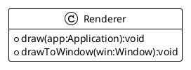
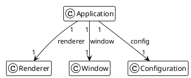

# Rendering things

## Requirements

The `Renderer` component will support all drawing operation for the `Application`
we are designing.

The `Renderer` will provide an internal drawing buffer that is a BufferedImage to support
drawing pipeline operation.

The buffer size in terms of `width` and `height` is defined through the following configuration
component and in the configuration parameters:

```properties
# Game Area to be rendered
app.game.area.width=320
app.game.area.height=200
```

And the `Renderer` will offer 2 public methods:

- `draw()` drawing all the application object on buffer,
- `drawToWindow(Window)` to copy buffer content to window frame.



And its integration will be done at application level:



## Design

The global overview (without implementation details) of the Renderer class:

```java
public class Renderer {
    private final BufferedImage buffer;

    public Renderer(Configuration config) {
        //...
    }

    public void draw(Application app) {
        //...
    }

    public void drawToWindow(Window window) {
        //...
    }
}
```

The constructor is nothing more than initializing the internal buffer to the right size, defined in configuration,

```java
public class Renderer {
    //...
    public Renderer(Configuration config) {
        this.buffer = new BufferedImage(
                (int) config.getGameArea().getWidth(),
                (int) config.getGameArea().getHeight(),
                BufferedImage.TYPE_INT_ARGB);
    }
    //...
}
```

### Drawing the objects

Drawing operations consists in

- clear the buffer,
- draw require graphics components (see what has been proposed in details at chapter [04](04-delegate_gameloop.md)),
- free graphics resources.

```java
public class Renderer {
    //...
    public void draw(Application app) {
        Graphics2D g = buffer.createGraphics();
        // clear rendering area.
        g.setColor(Color.BLACK);
        g.fillRect(0, 0, buffer.getWidth(), buffer.getHeight());
        // draw things
        app.getObjects().forEach(o -> o.draw(g));
        // release Graphics component.
        g.dispose();
    }
    //...
}
```

And a detailed method will draw GameObject according to its `ObjectType`:

```java
public class Renderer {
    //...
    private void drawGameObject(Graphics2D g, GameObject o) {
        switch (o.type) {
            case POINT -> {
                g.setColor(o.borderColor);
                g.fillRect((int) o.x, (int) o.y, 1, 1);
            }
            case LINE -> {
                g.setColor(o.borderColor);
                g.drawLine((int) o.x, (int) o.y, (int) (o.x + o.w), (int) (o.y + o.h));
            }
            case RECTANGLE -> {
                Rectangle2D rect = new Rectangle2D.Double(o.x, o.y, o.w, o.h);
                drawShape(g, o, rect);
            }
            case ELLIPSE -> {
                Ellipse2D ellipse = new Ellipse2D.Double(5, 10, 100, 150);
                drawShape(g, o, ellipse);
            }
            case IMAGE -> g.drawImage(o.image, (int) o.x, (int) o.y, null);
        }
    }
    //...
}
```

### Draw to window

drawToWindow() copy buffer to the window frame, like seen before.

```java
public class Renderer {
    //...
    public void drawToWindow(Window window) {
        window.getGraphics().drawImage(buffer,
                0, 0, window.getWidth(), window.getHeight(),
                0, 0, buffer.getWidth(), buffer.getHeight(),
                null
        );
    }
    //...
}
```

The integration of the rendering operation happens at the GameLoop implementation

from chapter [04](04-delegate_gameloop.md):

```java
public class StandardGameLoop implements GameLoop {
    //...
    private void render(Application app, long elapsed) {
        app.getRender().draw(app);
        app.getRender().drawToWindow(app.getWindow());
    }
    //...
}
```

## Enhancing the rendering pipeline

To enhance the `Renderer`, we are going to offer new capabilities on `GameObject` draw operation:
The possibility to render those object on different layers and in each layer, respecting a sort rendering priority.

We need to enhance also the GameObject itself by adding the required attributes:

```java
public class GameObject {
    //...
    private int layer;
    private int priority;
    //...
}
```

Those values can be set at `GameObject` creation with the corresponding fluent API setters.

```java
public class Application {
    //...
    public void createScene() {
        add(new GameObject("player")
                .setPosition(160.0, 100.0)
                .setDimension(16.0, 16.0)
                .setSpeed(0.0, 0.0)
                .setLayer(1)
                .setPriority(1)
        );
    }
    //...
}
```

And at the renderer implementation, at rendering time, the objects list is sorted according to layer and priority.

```java
public class Renderer {
    //...
    public void draw(Application app) {
        //...
        // draw things with higher layer / higher priority draw first.
        app.getObjects().stream()
                .sorted((a, b) -> a.layer > b.layer ? (a.priority > b.priority ? 1 : -1) : -1)
                .forEach(o -> drawGameObject(g, o));
        //...
    }
    //...
}
```
