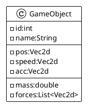

# Adding Physics

We had an `GameObject` easy to move with speed. but if we want to go further in terme of simulation, we need to enhance the way we compute the resulting position of our `GameObject`.

We need to propose a more realistic move and behavior. to satify this enew requirement, we are going to stay ans stick to some physical laws of simultaion in terms of speed, acceleration and materials.

## Moving from simple coordinate to vector

First we will adapt the GameObject to support some vector computation.



And the `Vec2d` object is this [Vec2d](https://github.com/mcgivrer/monoclass2/blob/master/src/main/java/com/demoing/app/core/math/Vec2d.java) class from one of my preview project.

Now we are going to be able to apply the Newtons laws on move equation:

The acceleration of applied on a GameObject s the sum of all applied forces, devided by its mass:

```Math
a = {\sum(F)\over m} t
```

where:

- `t` is the elapsed time since previous computation
- `m` is the mass of the `GameObject`
- `F` are all the forces applied on this GameObject
- `a` the resulting acceleration.

The speed for this GameObject will be the result of the applied acceleration:

```Math
v = v_0 * {1\over 2 } a t
```

where :

- `t` is the elapsed time since previous computation,
- `a` the `GameObject` acceleration,
- `v0` the previous speed value,
- `v` the resulting new speed.

And, finaly our `GameObject`'s position is :

```Math
p = p_0 + v * t
```

- `t` is the elapsed time since previous computation,
- `p0` the previous `GameObject` position,
- `v` the speed value

This will be adapted into Java language as :

```java
public class GameObject {
    public void update(double t){
        a = f.multiply(t/m);
        v += a.multiply(0.5*t);
        p += v.multiply(t);
        forces.clear();
    }
}
```
