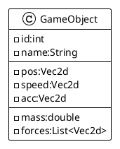

# Adding Physics

We had an `GameObject` easy to move with speed. but if we want to go further in terms of simulation, we need to enhance
the way we compute the resulting position of our `GameObject`.

We need to propose a more realistic move and behavior. to satisfy this new requirement, we are going to stay and stick
to some physical laws of simulation in terms of speed, acceleration and materials.

## Moving from simple coordinate to vector

First we will adapt the GameObject to support some vector computation.



And the `Vec2d` object is
this [Vec2d](https://github.com/mcgivrer/monoclass2/blob/master/src/main/java/com/demoing/app/core/math/Vec2d.java)
class from one of my preview project.

Now we are going to be able to apply the Newtons laws on move equation:

The acceleration of applied on a GameObject s the sum of all applied forces, divided by its mass:

```Math
a = {\sum(F)\over m} t
```

where:

- `t` is the elapsed time since previous computation
- `m` is the mass of the `GameObject`
- `F` are all the forces applied on this GameObject
- `a` the resulting acceleration.

The speed for this GameObject will be the result of the applied acceleration:

```Math
v = v_0 * {1\over 2 } a t
```

where :

- `t` is the elapsed time since previous computation,
- `a` the `GameObject` acceleration,
- `v0` the previous speed value,
- `v` the resulting new speed.

And, finally our `GameObject`'s position is :

```Math
p = p_0 + v * t
```

- `t` is the elapsed time since previous computation,
- `p0` the previous `GameObject` position,
- `v` the speed value

This will be adapted into Java language as :

```java
public class GameObject {
    public void update(double t) {
        a = f.multiply(t / m);
        v += a.multiply(0.5 * t);
        p += v.multiply(t);
        forces.clear();
    }
}
```

## the PhysicEngine

the new service `PhysicEngine` is dedicated to update all object of the Application.

```java
public class PhysicEngine {
    //...
    public void update(double elapsed) {
        app.getObjects().forEach(o -> {
            updateObject(o, elapsed);
            o.update(elapsed);
            constrainedBy(o, app.getGameArea());
        });
    }

    //...
    public void updateObject(double t) {
        a = f.multiply(t / m);
        v += a.multiply(0.5 * t);
        p += v.multiply(t);
        forces.clear();
    }
}
```

And this service is instantiated into the `Application.create()` :

```java
import com.demoapp.core.services.physic.PhysicEngine;

public class Application {
  //...
  private PhysicEngine physicEngine;

  public void create() {
    //...
    this.physicEngine = new PhysicEngine(this);
    //...
  }
  //...
}
```

And this service is now called from the `StandardGameLoop.update()` method:

```java
public class PhysicEngine {
    //...
    public void update(Application app, double elapsed) {
        app.getPhysicEngine().update(elapsed);
        app.getSceneManager().getCurrent().getCamera().update(elapsed);
    }
    //...
}
```

## Material

Now we have a moving GameObject with some realism, we need to mimic the real material with soe new parameters.
Any object is made with some material. A basic material can be simulated with minimum number of parameters:

- `elasticity`, to simulate material elasticity (sic) when an object collide another and integrate the resulting
  collision
  energy,
- `density`, to simulate how the collision energy is absorbed.
- `friction`, to represent the material surface quality, and how the object rubs on the floor, on in the air.

So those 3 parameters can be part of a new object: a `Material`. This material will be attached to a GameObject for
physic computation.

```plantuml
@startuml
!theme plain
hide methods
hide attributes
class Application
show PhysicEngine methods
class PhysicEngine{
  +update(Application,double):void
  -private updateObject(GameObject,double):void
}
class GameObject
show Material attributes
class Material {
 - name:String
 - elasticity:double
 - density:double
 - friction: double
}

Application "1"-->"1" PhysicEngine:physicEngine
GameObject "1"-->"1" Material:material
@enduml
```

You can notice that I add a name to the Material, only for be more comfortable on usage.

Then the `PhysicEngine.update()` part is modified as following:

```java
public class PhysicEngine {
    //...
    public void updateObject(GameObject go, double elapsed) {
        //...
        go.acc = force.multiply(t /
                (go.mass * go.material.density));
        go.speed = go.speed
                .add(go.acc
                        .multiply(0.5 * t)
                        .multiply(go.material.friction));
        //...
    }
    //...
}
```

### Default Materials

The `Material` class will also provide some default materials for easy configuration of `GameObject`.

```java
public class DemoScene extends AbstractScene {
    //...
    public void create(Application app) {
        GameObject player = new GameObject("player")
                .setType(GameObject.ObjectType.RECTANGLE)
                .setPosition(160.0, 100.0)
                .setDimension(16.0, 16.0)
                .setMass(100.0)
                .setMaterial(Material.SUPERBALL)
                .setLayer(1)
                .setPriority(1);
        app.add(player);
        //...
    }
    // ...
}
```

Some basic data for materials:

| name      | elasticity | density | friction |
|:----------|:----------:|:-------:|:--------:|
| default   |    0.0     |   1.0   |   1.0    |
| rubber    |    0.6     |   1.7   |   0.3    |
| superBall |    0.98    |   0.7   |   0.3    |
| steel     |    0.12    |   1.5   |   0.1    |
