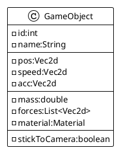
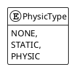
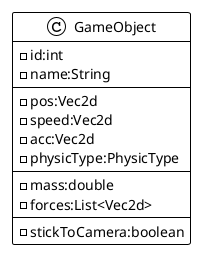

# Enhanced Renderer

## Intend

The today `Renderer` is efficient, but just provides drawing operation with a specific order.
I propose here to add a new feature concerning the layer and the draw sort order: adding some virtual layers, and let
them be stick to the active `Camera`.

But the need to get object stick to screen imply some enhancement of the `GameObject` itself with a new boolean
attribute: `stickToCamera`.



## Renderer

The `Renderer` must evolve accordingly to use this new flag at render time, knowing if the `Camera` focus must be
moved or not.

```java
public class Renderer {

    public void draw(Application app, Scene scene) {
        //...
        // draw things with higher layer / higher priority draw first.
        app.getObjects().stream()
                .sorted((a, b) -> a.layer > b.layer ? (a.priority > b.priority ? 1 : -1) : -1)
                .forEach(o -> drawGameObject(scene, g, o));
        //...
    }

    private void drawGameObject(Scene scene, Graphics2D g, GameObject o) {
        Camera currentCam = scene.getCamera();
        if (Optional.ofNullable(currentCam).isPresent() && !o.stickToCamera) {
            g.translate(-currentCam.pos.x, -currentCam.pos.y);
        }

        switch (o.type) {
            case POINT -> {
                g.setColor(o.borderColor);
                g.fillRect((int) o.pos.x, (int) o.pos.y, 1, 1);
            }
            //...
        }
        //...
        if (Optional.ofNullable(currentCam).isPresent() && !o.stickToCamera) {
            g.translate(currentCam.pos.x, currentCam.pos.y);
        }

    }
    //...
}
```

The Renderer class is enhanced with new parameter on the `drawGameObject` call and the object drawing is integrating the
Camera focusing mechanism to take in account the `stickToCamera` flag value.

## Using a new PhysicType

The `PhysicEngine` must not perform computation of physic laws on the `stickToCamera` object, so I decided to enhance
the
`GameObject` with a new attribute, more dedicated to physics, with a `physicType` attribute.



So the GameObject class get a new attribute with its accessors:



## Physic Engine update

And the `PhysicEngine` is updated to not compute things for `GameObject` having a `physicType` set to `NONE` or `STATIC`
by introducing a switch case at GameObject update method level:

```java
class PhysicEngine {
    //...
    public void updateObject(GameObject go, double elapsed) {
        double t = elapsed / 1000000.0;
        switch (go.getPhysicType()) {
            case NONE:
            case STATIC:
                break;
            case DYNAMIC:
                // Compute things for dynamic object only
                break;
        }
    }
    //...
}
```

So only object with `DYNAMIC` physic type will be processed thought the Newton's laws.
`NONE` and `STATIC` ones a voluntary not processed today (but some evolution could happen).

