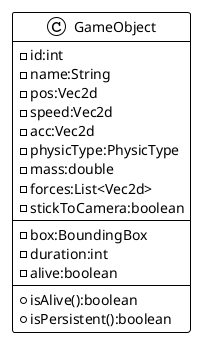
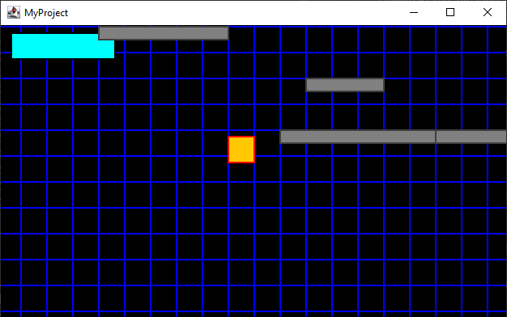

# Collision Detection

Collision Detection has 2 possibilities : 2 dynamic object are colliding, or a dynamic and sa static object are
colliding. These are the 2 cases we will process in our `CollisionDetection` service.

Our collision algorithm will be based on ethe famous AABB
principle: [Axis Aligned Bounding Box](https://en.wikipedia.org/wiki/Minimum_bounding_box#Axis-aligned_minimum_bounding_box "as each time, Wikipedia knows best")
.

Each object (`GameObject`) is enclosed in a RECTANGULAR or an ELLIPSE box, and the x and y coordinated are compared
regarding
their width and height:


Those objects will also provide how the collision detection must behave regarding their physic type: we need to use
carefully the PhysicType with STATIC and DYNAMIC values (already define in the [chapter 11](11-enhanced-renderer.md).

## Adding new capabilities on GameOBject

Before going to the Collision things, we need to add new capabilities. One is important for next coming animation need,
the `alive` status. It will tell us if a `GameObject` must be maintained by the system or if it is no more used, and
does not need to
be updated bay all the services (`PhysicEngine`, `Renderer`, etc...).

This `alive` boolean flag depends on the `duration` integer value, corresponding to the life duration of a `GameObject`.
By default, the value of `duration` is initialized to `-1`, meaning it will never die.

But setting a value greater than zero (0) will define a life duration in nanos for this `GameObject`. And until this
duration value is greater than `0` and is not equals to `-1`, the `alive` flag will be `true`.

We will also add a `box`, corresponding to the containing box for our `GameObject`, it will be updated each time
the `dimension` or the position (`pos`) are changing. :



And the corresponding code for the new attributes and corresponding methods:

```java
public class GameObject {
    //...
    public Rectangle2D box;
    public boolean alive;
    public int duration = -1;

    //...
    public boolean isAlive() {
        this.alive = isPersistent() || duration > 0;
        return this.alive;
    }

    public boolean isPersistent() {
        return this.duration == -1;
    }
    //...

    public GameObject setDuration(int d) {
        this.duration = d;
        return this;
    }
    //...
    
    public void update(deouble elapsed) {
        box.setRect(pos.x, pos.y, width, height);
    }
}
```

## Collision for GameObject

The `GameObject` already take benefits of this type for the `physicEngine` computation. Now we will reuse it into the
collision detection and resolution.

The implementation for colliding object will be based on the `Shape` variant object `Rectangle2D` and `Ellipse2D`
from the `java.awt.geom` package.

We need to add a collision box (`cbox`) based on a Boundary box `bbox` for the relative `GameObject` which will be
computed accordingly to the `ObjectType` as a `Rectangle2D` or an `Ellipse2D`:

```java
public static class GameObject {
    //...
    // Boundary box
    public Shape bbox;
    // Collision box
    public Shape cbox;

    //...
    // initialize the default collision box equals to the existing bounding box
    public GameObject setDimension(double w, double h) {
        this.width = w;
        this.height = h;
        setCollisionBox(0, 0, 0, 0);
        return this;
    }

    //...
    public GameObject setCollisionBox(double left, double top, double right, double bottom) {
        switch (type) {
            case IMAGE, RECTANGLE, default -> this.bbox = new Rectangle2D.Double(left, top, right, bottom);
            case ELLIPSE -> this.bbox = new Ellipse2D.Double(left, top, right, bottom);
        }
        update(0.0);
        return this;
    }

    //...
    public void update(double elapsed) {
        //...
        switch (type) {
            case RECTANGLE, IMAGE, default -> this.cbox = new Rectangle2D.Double(
                    box.getX() + bbox.getBounds().getX(),
                    box.getY() + bbox.getBounds().getY(),
                    box.getWidth() - (bbox.getBounds().getWidth() + bbox.getBounds().getX()),
                    box.getHeight() - (bbox.getBounds().getHeight() + bbox.getBounds().getY()));
            case ELLIPSE -> this.cbox = new Ellipse2D.Double(
                    box.getX() + bbox.getBounds().getX(),
                    box.getY() + bbox.getBounds().getY(),
                    box.getWidth() - (bbox.getBounds().getWidth() + bbox.getBounds().getX()),
                    box.getHeight() - (bbox.getBounds().getHeight() + bbox.getBounds().getY()));
        }
        //...
    }
}
```

## Collision Detector

Ok, now the fun part with the collision detection :

```java
public static class CollisionDetector {
    //...
    private void detect() {
        List<GameObject> targets = colliders.values()
                .stream()
                .filter(e -> e.isAlive() || e.isPersistent())
                .toList();
        for (GameObject e1 : colliders.values()) {
            e1.collide = false;
            for (GameObject e2 : targets) {
                e2.collide = false;
                if (e1.id != e2.id && e1.cbox.getBounds().intersects(e2.cbox.getBounds())) {
                    resolve(e1, e2);
                }
            }
        }
    }
    //...
}
```

As soon a collision is detected, we try and solve it :

```java
public static class CollisionDetector {
    //...
    private void resolve(GameObject e1, GameObject e2) {
        e1.collide = true;
        e2.collide = true;
        Vec2d vp = new Vec2d((e2.x - e1.x), (e2.y - e1.y));
        double distance = Math.sqrt((e2.x - e1.x) * (e2.x - e1.x) + (e2.y - e1.y) * (e2.y - e1.y));
        Vec2d colNorm = new Vec2d(vp.x / distance, vp.y / distance);
        if (e1.physicType == PhysicType.DYNAMIC && e2.physicType == PhysicType.DYNAMIC) {
            Vec2d vRelSpeed = new Vec2d(e1.dx - e2.dx, e1.dy - e2.dy);
            double colSpeed = vRelSpeed.x * colNorm.x + vRelSpeed.y * colNorm.y;
            var impulse = 2 * colSpeed / (e1.mass + e2.mass);
            e1.dx -= Utils.ceilMinMaxValue(impulse * e2.mass * colSpeed * colNorm.x,
                    config.speedMinValue, config.speedMaxValue);
            e1.dy -= Utils.ceilMinMaxValue(impulse * e2.mass * colSpeed * colNorm.y,
                    config.speedMinValue, config.speedMaxValue);
            e2.dx += Utils.ceilMinMaxValue(impulse * e1.mass * colSpeed * colNorm.x,
                    config.speedMinValue, config.speedMaxValue);
            e2.dy += Utils.ceilMinMaxValue(impulse * e1.mass * colSpeed * colNorm.y,
                    config.speedMinValue, config.speedMaxValue);
            if (e1.name.equals("player") && config.debug > 4) {
                System.out.printf("e1.%s collides e2.%s Vp=%s / dist=%f / norm=%s\n", e1.name, e2.name, vp, distance, colNorm);
            }
        } else {
            if (e1.physicType == PhysicType.DYNAMIC && e2.physicType == PhysicType.STATIC) {
                if (e1.y + e1.height > e2.y && vp.y > 0) {
                    e1.y = e2.y - e1.height;
                    e1.dy = -e1.dy * e1.elasticity;
                } else {
                    e1.dy = -e1.dy * e1.elasticity;
                    e1.y = e2.y + e2.height;
                }
                if (e1.name.equals("player") && config.debug > 4) {
                    System.out.printf("e1.%s collides static e2.%s\n", e1.name, e2.name);
                }
            }
        }
    }
    //...
}
```

Ouch !

The resolve collision is really tricky. yes, and it depends on what collide what.

> **NOTE**
> As we intend to develop Platform Game, we will concentrate our effort on such usage.

We so first compute basic values like distance, penetration vector and its corresponding normalized vector.

then, we detect is we are in front of (1) DYNAMIC vs. DYNAMIC collision or a (2) DYNAMIC vs. STATIC collision.

1. The first case is the more tricky and require more mathematics. I won't go in details, because this not my special
   skills. please, go and visit the very good post on [the Spicy Yoghurt](https://spicyyoghurt.com/) :
   ['Collision Detection Physic'](https://spicyyoghurt.com/tutorials/html5-javascript-game-development/collision-detection-physics "Go and visit the really good article about javascript game development")
   , all is really crystal clear.

```java
public static class CollisionDetector {
    //...
    public void resolve(GameObject e1, GameObject e2) {
        //...
        // Dynamic case
        Vec2d vRelSpeed = new Vec2d(e1.dx - e2.dx, e1.dy - e2.dy);
        double colSpeed = vRelSpeed.x * colNorm.x + vRelSpeed.y * colNorm.y;
        var impulse = 2 * colSpeed / (e1.mass + e2.mass);
        // Resulting effect from e2 to e1
        e1.dx -= Utils.ceilMinMaxValue(impulse * e2.mass * colSpeed * colNorm.x,
                config.speedMinValue, config.speedMaxValue);
        e1.dy -= Utils.ceilMinMaxValue(impulse * e2.mass * colSpeed * colNorm.y,
                config.speedMinValue, config.speedMaxValue);
        // Resulting effect from e1 to e2
        e2.dx += Utils.ceilMinMaxValue(impulse * e1.mass * colSpeed * colNorm.x,
                config.speedMinValue, config.speedMaxValue);
        e2.dy += Utils.ceilMinMaxValue(impulse * e1.mass * colSpeed * colNorm.y,
                config.speedMinValue, config.speedMaxValue);
        //...
    }
    //...
}
```

2. With a DYNAMIC vs. STATIC, things are different : one of the 2 object won't move, and the reverse effect is different
   on the DYNAMIC object. As here most if the STATIC object would be platform, we will test differently things: we will
   only detect if the DYNAMIC object is upper or bellow the STATIC one, and modify its vertical position regarding the
   position and size of STATIC object.

```java
public static class CollisionDetector {
    //...
    public void resolve(GameObject e1, GameObject e2) {
        //...
        // Static case
        if (e1.y + e1.height > e2.y && vp.y > 0) {
            e1.y = e2.y - e1.height;
            e1.dy = -e1.dy * e1.elasticity;
        } else {
            e1.dy = -e1.dy * e1.elasticity;
            e1.y = e2.y + e2.height;
        }
    }
    //...
}
```

## Configuration

You may have noticed the new configuration attributes:

- `speedMinValue` the minimum speed value below the value is reduced to 0.0 to remove noise effect on GameObject's speed
  computation (default value in configuration properties file : `app.physic.speed.min=0.1`),
- `speedMaxValue` the maximum speed that will be used as a max threshold for any GameObject (default value in
  configuration
  properties file : `app.physic.speed.max=3.2`),.

- `accMinValue` the minimum acceleration value below the value is reduced to 0.0 to remove noise effect on GameObject's
  acceleration (default value in configuration properties file : `app.physic.acceleration.min=0.01`),
- `accMaxValue` the maximum acceleration that will be used as a max threshold for any GameObject (default value in
  configuration properties file : `app.physic.acceleration.max=3.5`),.

And specific values for collision resolution:

- `colSpeedMinValue` the minimum speed value below the value is reduced to 0.0 to remove noise effect on GameObject's
  speed
  computation on collision (default value in configuration properties file : `app.physic.speed.min=0.1`),
- `colSpeedMaxValue` the maximum speed that will be used as a max threshold for any GameObject on collision (default
  value
  in configuration properties file : `app.physic.speed.max=3.2`),.

```properties
app.physic.speed.min=0.1
app.physic.speed.max=3.2
app.physic.acceleration.min=0.01
app.physic.acceleration.max=3.5
app.collision.speed.min=0.1
app.collision.speed.max=1.2
```

_figure $fig+ - `app.properties` file modified with new `PhysicEngine` threshold values._

Here is a screen capture from the new CollisionDetector with platforms implementation:



_figure $fig+ - Collision detection and platforms_
