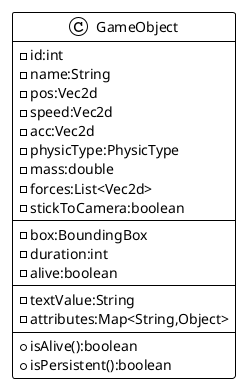

# Adding a new TEXT type

Event if we already have a bunch of `ObjectType`, one was not already implemented: TEXT.
If I want to draw some score, number of life, or just some text on my screen, I need a way to do it.

So let's add a new TYPE to the `ObjectType`, and add it to the different services to manage it.

## TEXT

First let's add this new TEXT type to the corresponding enumeration:

```java
public class GameObject implements OnCollisionEvent {
    public enum ObjectType {
        //...           
        // draw a Text from textValue
        TEXT
    }
    //...
}
```

## Drawing text

### Add something to the `GameObject`

To draw some text, we need somewhere a string containing this text. but adding a simple text value would be a too simple
approach.
Sometimes the text to be drawn, like score or some numbers, must be formatted. So let's propose a new way
to proceed.

I am going to add a new capability to the `GameObject`: an attributes map.

These `attributes` map will allow us to add dynamically some new data to any `GameObject` and those data would be
accessible from anywhere

And I am going to use it as extension possibilities for text rendering.



## Attributes for Text

Our text valur will be fed some custom capabilities like :

- `textFormat` proposing a way to define a _printf_ format approach to format text,
- `textValue` the value that must be interpreted through te `textFormat` to feed the `GameObject.textValue`,
- `textFontSize` to define the font rendering size for this text.

Those attributes will be used only if there exist in the attributes map. if not, the `Gameobject.textValue`
is simply directly drawn.

### GameObject enhancement

The GameObject class is now adapted with new text processing capability :

```java
public class GameObject {
    //...
    public GameObject addAttribute(String key, Object value) {
        attributes.put(key, value);
        return this;
    }

    //...
    public void update(double elapsed) {
        // update the bounding box.
        box.setRect(pos.x, pos.y, w - 1, h);
        updateText();

        // update the collision box.
        //...
    }

    private void updateText() {
        if (attributes.containsKey("textFormat") && attributes.containsKey("textValue")) {
            this.textValue = String.format(
                    (String) attributes.get("textFormat"),
                    attributes.get("textValue"));
        }
    }
}
```

If a "textFormat" string attribute exists, we search for a "textValue" attribute to be formatted, and assign
the `GameObject.textValue`
with this new one.

### Rendering that

The Renderer service must be updated with new drawing capability upon the `TEXT` for the `GameObject` type:

```java
public class Renderer {
    //...
    private void drawGameObject(Scene scene, Graphics2D g, GameObject o) {

        //...
        switch (o.type) {
            //...
            case TEXT -> {
                g.setColor(o.borderColor);
                if (Optional.ofNullable(o.font).isPresent()) {
                    g.setFont(o.font);
                }
                if (o.attributes.containsKey("textFontSize")) {
                    g.setFont(g.getFont().deriveFont((float) o.attributes.get("textFontSize")));
                }
                g.drawString(o.textValue, (int) o.pos.x, (int) o.pos.y);
            }
        }
        //...
    }
    //...
}
```

And we introduce a new attribute `textFontSize` about... the font size, to set the size of the font (???:))

And to test that, we need to chang ethe DemoScene.

## DemoScene support text !

```java
public class DemoScene extends AbstractScene {
    //...
    public void create(Applciation app) {
        //...
        // add an object stick to camera
        GameObject score = new GameObject("score");
        score.setType(GameObject.ObjectType.TEXT);
        score.setPhysicType(PhysicType.NONE);
        score.setPosition(8.0, 36.0);
        score.setDimension(64.0, 16.0);
        score.setBorderColor(Color.WHITE);
        score.setFillColor(Color.CYAN);
        score.setMass(0.0);
        score.setLayer(0);
        score.setPriority(1);
        score.setStickToCamera(true);
        score.addAttribute("textFormat", "%06d");
        score.addAttribute("textValue", scoreValue);
        score.addAttribute("textFontSize", 20.0f);
        app.add(score);

        //...
    }
}
```